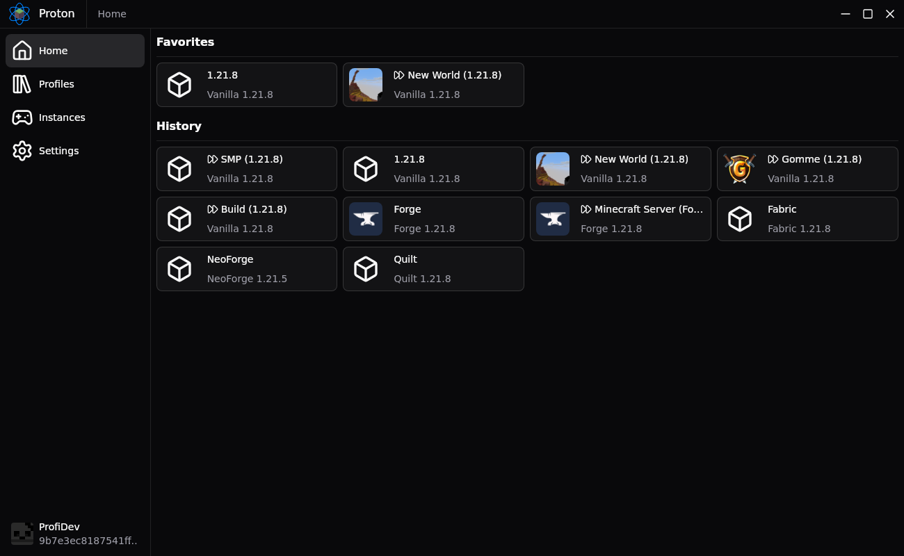

# Proton Minecraft Launcher

A modern, fast, and feature-rich Minecraft launcher built with Tauri, Rust, and SvelteKit. Proton provides a clean interface for managing your Minecraft installations, profiles, and mods with support for multiple mod loaders.

[](https://github.com/ProfiiDev/proton/releases/latest)
[](https://github.com/ProfiiDev/proton/issues)
[](https://github.com/ProfiiDev/proton/blob/main/LICENSE)
[](https://github.com/ProfiiDev/proton/actions)


## ✨ Features

### Core Features

- **Multi-Account Support**: Seamlessly manage multiple Microsoft accounts
- **Profile Management**: Create and organize multiple game profiles with custom settings
- **Instance Management**: Monitor and control running game instances
- **Version Management**: Support for all Minecraft versions including snapshots
- **Mod Loader Support**: Full support for Fabric, Quilt, Forge, and NeoForge
- **Favorites**: Mark profiles, worlds and servers as favorites for quick access
- **Offline Mode**: Play without internet connection using cached authentication
- **Auto-Updates**: Automatic launcher updates via built-in updater
- **Cross-Platform**: Native support for Windows, macOS, and Linux

### Advanced Features

- **Skins & Capes Management**: Upload and manage custom skins, browse available capes and apply them easily
- **Quick Play**: Automatically detect and quickly access your favorite servers and worlds
- **Java Management**: Automatic Java installation and version management with ability for custom RAM limits and JVM arguments
- **Detailed Logging**: Comprehensive logging system for troubleshooting

### Upcoming Features 🚧

- **Mod Management**: Download and install mods from Modrinth and CurseForge
- **Resource Pack Browser**: Browse and install resource packs
- **Shader Pack Support**: Easy shader installation and management
- **Modpack Installation**: One-click modpack installation from popular platforms
- **Themes**: Customizable themes for better user experience
- **Import/Export**: Easy profile and settings migration

## 📥 Installation

### Windows

1. Download the latest `*-setup.exe` installer from the [Releases](https://github.com/ProfiiDev/proton/releases/latest) page
2. Run the installer and follow the setup wizard
3. Launch Proton from the Start Menu or desktop shortcut

### macOS

1. Download the `*.dmg` file from the [Releases](https://github.com/ProfiiDev/proton/releases/latest) page
2. Open the DMG and drag Proton to your Applications folder
3. Launch from Applications (you may need to allow the app in System Preferences > Security)

### Linux

#### AppImage (Universal)

1. Download the `*.AppImage` from the [Releases](https://github.com/ProfiiDev/proton/releases/latest) page
2. Make it executable: `chmod +x *.AppImage`
3. Run: `./*.AppImage`

#### Debian/Ubuntu (.deb)

```bash
# Download the .deb file, then:
sudo dpkg -i proton_*.deb
sudo apt-get install -f  # Fix any dependency issues
```

#### NixOS

Proton includes full Nix Flake support for NixOS users:

1. Add proton as an input to your `flake.nix`:

```nix
{
  inputs = {
    proton.url = "github:ProfiiDev/proton";
  };
}
```

2. Add the package to your system packages:

```nix
{ inputs, ... }:
{
  environment.systemPackages = [
    inputs.proton.packages.${system}.proton
  ];
}
```

## 🔄 Updating

### Automatic Updates

Proton includes an built-in auto-updater that will notify you when new versions are available and handle the update process automatically (Does not work with nix flakes).

### Manual Updates

- **Windows/macOS**: Download and install the latest version from GitHub Releases
- **Linux AppImage**: Replace your existing AppImage with the new version
- **Package Managers**: Download the latest package for your distribution and install it
- **NixOS**: Update your flake inputs

## 🚀 Getting Started

1. **Add Account**: Sign in with your Microsoft account via the Settings → Accounts page
2. **Create Profile**: Go to Profiles and click the "+" button
   - Choose your Minecraft version
   - Select a mod loader (optional)
3. **Launch Game**: Click the play button on your profile to start Minecraft

## 🛠️ Development

### Prerequisites

- **Devenv** (latest stable)
- **Direnv** (for automatic environment loading)

### Development Setup

```bash
# Clone the repository
git clone https://github.com/ProfiiDev/proton.git
cd proton

# Optional: Allow direnv
direnv allow
# Or manually enter the shell
devenv shell

# Install dependencies
npm install

# Start development app
cd app && npm run tauri dev
```

### Project Structure

```
proton/
├── app/                    # Frontend (SvelteKit + TypeScript)
│   ├── src/               # Svelte components and pages for app UI
│   ├── src-tauri/         # Tauri Rust backend
│   └── static/            # Static assets
├── backend/               # Optional standalone backend
├── .github/workflows/     # CI/CD workflows
└── devenv.nix            # Development environment config
```

### Building

```bash
# Build for specific platform
cd app && npm run tauri build

# Build for different architectures (macOS)
npm run tauri build -- --target aarch64-apple-darwin
npm run tauri build -- --target x86_64-apple-darwin
```

### Contributing

1. Fork the repository
2. Create a feature branch: `git checkout -b feature/amazing-feature`
3. Make your changes and test thoroughly
4. Commit your changes: `git commit -m 'Add amazing feature'`
5. Push to the branch: `git push origin feature/amazing-feature`
6. Open a Pull Request

## 📄 License

This project is licensed under the MIT License - see the [LICENSE](LICENSE) file for details.

## 🙏 Acknowledgments

- Built with [Tauri](https://tauri.app/)
- UI components powered by [SvelteKit](https://kit.svelte.dev/), [TailwindCSS](https://tailwindcss.com/) and [ShadcnSvelte](https://shadcn-svelte.com/)
- Icons from [Lucide](https://lucide.dev/)

## ⭐ Support

If you find Proton useful, please consider:

- ⭐ Starring this repository
- 🐛 Reporting bugs and suggesting features
- 🤝 Contributing to the codebase
